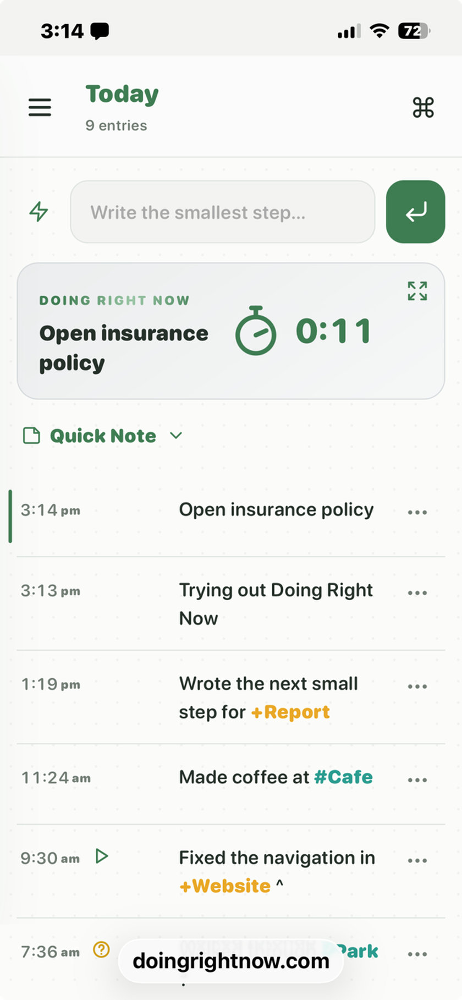

# Doing Right Now

A minimalist, offline-first journal to cure task paralysis. No logins, no cloud — just focus on your next tiny step.

**Don’t plan your entire day. Just start with what’s right in front of you.**

Not a planner, to-do list, or habit tracker. Write one timestamped line — what you just did, or the tiny next step — and do that. Each line lowers the bar for the next one. If you drift, the last line is exactly where you left off.

[Use it at DoingRightNow.com](https://doingrightnow.com/) · [Open the journal](https://doingrightnow.com/DoingRightNow) · [Press kit](press/README.md)



## How it works

One prompt: **What are you doing right now?**

- **Shrink the next step.** Don’t write “Write the report.” Write “Open the document.”
- **Empty your working memory.** Your brain is a processor, not a storage drive. Log the line so you don’t have to hold it in your head.
- **Anchor your attention.** Your timeline is a safety net. Come back anytime and see exactly what you were just doing.

Entries group by day in Today, Yesterday, 7-day, 30-day, 365-day, and All views.

## Markup

Optional tags in any line:

| Syntax | Meaning |
| --- | --- |
| `@person` | Person |
| `#location` | Place |
| `+project` | Project |
| `^` | Marks the line as started |
| `!` | Marks the line as important |
| `?` | Marks the line as a question |
| `` `text` `` | Monospace highlight |

Markers are standalone symbols. People, Places, Projects, and Quick Add suggestions are managed in Settings.

## Public beta

The current release is **1.0.0-beta.1**.

- Drawer navigation and substring search across the journal
- Entry actions for copying to Today, toggling markers, and deleting
- Quick Note, Settings-managed Quick Add templates, and tag suggestions
- Zen mode and a keyboard command palette
- Day ratings, started/total counts, and configurable trophies
- Light, dark, and system appearance with six accents
- Complete JSON export/import with replacement confirmation
- Offline PWA support

## Run locally

Open `index.html` in a browser, or serve the folder:

```bash
python3 -m http.server 8000
```

Then visit [http://127.0.0.1:8000/](http://127.0.0.1:8000/).

| File | Role |
| --- | --- |
| `index.html` | Landing page |
| `DoingRightNow.html` | The journal (single file, no build step) |
| `press/` | Icons, screenshots, copy for reviewers & directories |

## Privacy

Everything lives in this browser’s IndexedDB. No accounts, no cloud, no tracking. Export a JSON backup or manage stored data from System.

## Credits

Made by [Simpler Tasks](https://simplertasks.com).

## License

[MIT](LICENSE) © 2026 Simpler Tasks
