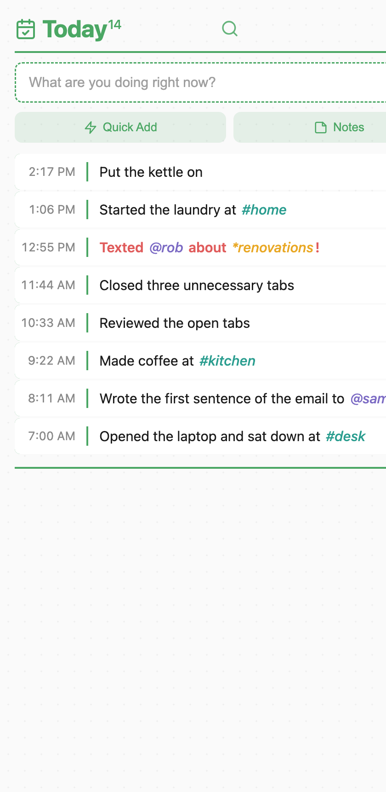

# Doing Right Now

A minimalist, offline-first journal to cure task paralysis. No logins, no cloud — just focus on your next tiny step.

**Don’t plan your entire day. Just start with what’s right in front of you.**

Not a planner, to-do list, or habit tracker. Write one timestamped line — what you just did, or the tiny next step — and do that. Each line lowers the bar for the next one. If you drift, the last line is exactly where you left off.

[Use it at DoingRightNow.com](https://doingrightnow.com) · [Open the journal](DoingRightNow.html)



## How it works

One prompt: **What are you doing right now?**

- **Shrink the next step.** Don’t write “Write the report.” Write “Open the document.”
- **Empty your working memory.** Your brain is a processor, not a storage drive. Log the line so you don’t have to hold it in your head.
- **Anchor your attention.** Your timeline is a safety net. Come back anytime and see exactly what you were just doing.

Entries group by day: Today, 2d, 3d, 7d, or All.

## Markup

Optional tags in any line:

| Syntax | Meaning |
| --- | --- |
| `@person` | Person |
| `#location` | Place |
| `*project` | Project |
| `!` | Makes the line bold and red |

## Gestures

- **Swipe left** to delete an entry
- **Swipe right** (or hover → calendar) to bring a line into Today — the original stays
- Search across days from the Today header

Also included: quick-add templates, a scratchpad, dark mode, font size, and a trophy on a day once you hit a set number of entries.

## Run locally

Open `index.html` in a browser, or serve the folder:

```bash
python3 -m http.server 8000
```

Then visit [http://127.0.0.1:8000/](http://127.0.0.1:8000/).

| File | Role |
| --- | --- |
| `index.html` | Landing page |
| `DoingRightNow.html` | The journal (single file, no build step) |

## Privacy

Everything lives in this browser’s `localStorage`. No accounts, no cloud, no tracking. Export or clear data from Settings.

## Credits

- [Event illustrations by Storyset](https://storyset.com/event)

Made by [Simpler Tasks](https://simplertasks.com).

## License

[MIT](LICENSE) © 2026 Simpler Tasks
