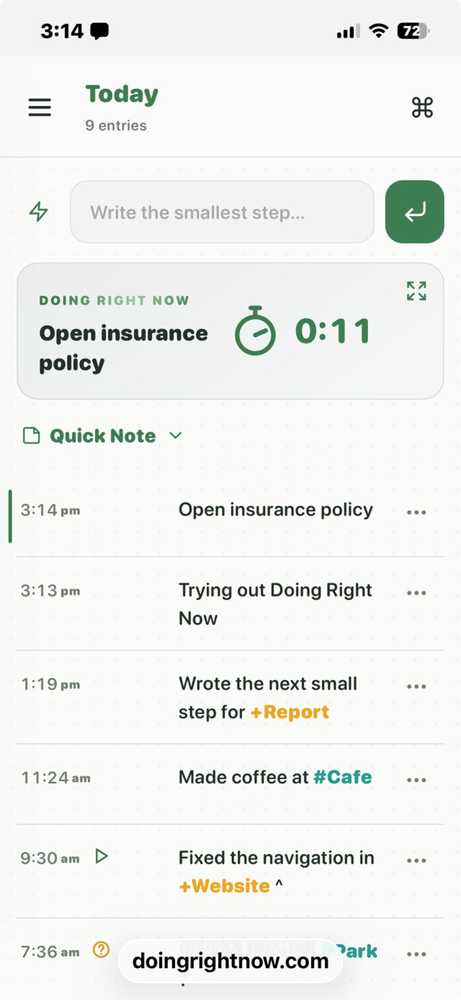

# Doing Right Now — Help

A journal for getting unstuck. Write one line for what you're doing right now, timestamp it automatically, and move on. No planning, no streaks, no pressure to finish.

This reference covers the **1.0.0-beta.1** public beta.

[New here? Read the philosophy →](/guide)

---

## Quick Start

1. Open the journal — you land on **Today**.
2. A new journal starts with one normal entry, **Trying out Doing Right Now**, to demonstrate the journal. You can edit or delete it.
3. Type what you're doing right now in the composer at the top, then press **Enter** or the Enter-icon button.
4. When what you're doing changes, write the next line. That's the whole app.
5. Everything stays in this browser — no sign-up and no cloud sync.

Two brief, dismissible messages guide your first entry and then disappear permanently. That's enough to start. Everything below is optional.

---

## The Journal

- The **Today** composer creates a timestamped entry. The newest entry also appears in the **Doing Right Now** card with its elapsed timer when enabled.
- Entries can't be reordered, and their timestamps can't be changed.
- Open the navigation drawer with the hamburger. Tap the current view title, such as **Yesterday** or **Search**, to return directly to Today; tapping **Today** scrolls to the top without opening the keyboard.
- Tap an entry—or anywhere on the current card except its Zen button—to view and edit its complete text.

## Editing a Line

- The dialog editor supports multiple lines and up to **1,000 characters**, with a live character count. Press **Enter** to save or **Shift+Enter** to add a new line.
- Choose **Save** to keep changes, **Cancel** to discard them, or **Delete** and confirm to remove the entry.
- Long entries are shortened to three lines with an ellipsis in the journal display. The editor always shows the complete text.
- Addresses beginning with `http://`, `https://`, or `www.` appear as openable links in the editor and entry-actions dialog.

## Entry Actions

Use the **ellipsis** beside an entry to open its actions:

- **Copy to Today** duplicates it with a new current timestamp; the original remains unchanged.
- **Mark as started (`^`)** — you began this. Counts in the day's started total.
- **Mark as completed (`"`)** — you finished a small step. Different from started; it does not count in started/total.
- **Mark as important (`!`)** — worth noticing.
- **Mark as question (`?`)** — an open loop.
- An entry can have only one of these special markers. Choosing another replaces the current one.
- **Delete entry** asks for confirmation before permanently removing it.

---

## Tags & Formatting

Optional shorthand:

- `@name` tags a person and is shown in violet.
- `+project` tags a project and is shown in amber.
- `#place` tags a place and is shown in teal.
- `^` as a standalone marker means started and counts in the day's started total.
- `"` as a standalone marker means you completed a small step. It is not a start and does not count in started/total.
- `!` as a standalone marker means important.
- `?` as a standalone marker means question or open loop.
- Backticks display inline text in monospace, such as `` `next step` ``.

Example: `Email @Bill about +Website ^`

Type `@`, `+`, or `#` to see matching suggestions. Suggestions come only from the People, Projects, and Places lists managed in **Settings**. Matching is case-insensitive and based on the text after the prefix.

Special markers are standalone symbols, and an entry can contain only one of `^`, `"`, `!`, or `?`. If you type more than one, the last one is kept. Emoji are ordinary searchable text; for example, 🤡 can flag a distraction and ✅ can flag a small win.

## Search

Open **Search** from the drawer or command palette. Search is a simple, case-insensitive **substring search** across every entry.

- Typing `Bill` finds that sequence anywhere, including in `@Bill`. Typing `@Bill` narrows the substring to the prefixed text.
- Search opens with no results and a prompt to type. Results update as you type and display newest first.
- Search tags directly with `@person`, `+project`, or `#place`.
- **Copy** copies matching entries as plain text.
- **Edit** opens an editable plain-text preview before copying; changing the preview does not change the journal.

## Quick Add

Quick Add stores reusable activity text. Manage the list in **Settings → Quick Add**.

1. Use the lightning button beside the Today composer to open the Quick Add menu.
2. Choose an item to append it to anything already in the composer.
3. Edit the combined text if needed, then press **Enter** or the Enter-icon button to create the entry.

The full entry dialog also displays Quick Add items as buttons. Templates may include tags, markers, and backtick formatting.

## Quick Note

Quick Note is a shared scratchpad below the current card for anything that is not a timestamped entry.

- Use the **Quick Note** control and chevron to open or close it.
- It auto-saves as you type and is shared across Today rather than attached to a date.
- Its small **Copy** button copies only the note.
- The command palette can open and focus Quick Note directly.

## Views, Copy & Editable Plain Text

- History views group entries by day and show the newest entries first.
- In Yesterday, 7-, 30-, 365-day, All journal, and Search views, **Copy** sends displayed entries to the clipboard as readable plain text.
- **Edit** opens the same plain text in a dialog. You may revise it before copying; those revisions never alter saved entries.
- Plain text includes date headings, optional ratings as `*` characters, timestamps, and entry text.

## Command Palette & Zen

- The right side of the header contains only the command icon; the hamburger on the left opens the navigation drawer. Open the palette with its icon or **⌘K**/**Ctrl+K**, filter by typing, and use the arrow keys and Enter to select.
- Commands cover adding an activity; Today, Yesterday, 7-, 30-, 365-day, and All views; Search; Quick Note; Zen mode; Settings; System; Help; appearance; and temporary Developer tools. **Add an activity** and **Go to Today** stay first; the remaining commands are alphabetical.
- Use the expand button on the current card to enter **Zen mode**, a distraction-free full-screen view of the current entry, elapsed duration, and current clock time. Started, completed, important, and question markers appear as icons instead of `^`, `"`, `!`, or `?`. Its **+** returns to Today ready to add another activity.

---

## Day Ratings & Counts

- On any **past** day, tap the date to cycle a star rating from 0 to 5. Today can't be rated.
- Every day header shows **started/total**. “Started” means entries carrying the `^` marker.
- A trophy appears when a day's total reaches the threshold configured in Settings (default 6).

## Timer on the Current Line

The elapsed-time display on today's current card shows how long the newest entry has been current. It is enabled by default, but it is optional.

- It counts seconds and minutes, then hours, up to **8hr+**.
- The stopwatch hand circles every minute to show passing time; it is not a target or countdown.
- If the timer feels distracting, visually dominant, or creates pressure, turn it off in **Settings → Timer on current entry**. The journal works exactly the same without it.
- The duration does not use AM/PM and is not logged or reported elsewhere.

## Theme & Appearance

- Choose **System**, **Light**, or **Dark** in Settings, or use **Toggle Light/Dark** in the command palette.
- Choose Small, Medium, or Large text and one of six accents: Green, Blue, Violet, Amber, Coral, or Pumpkin. The app icon remains green.
- Choose 12- or 24-hour timestamps and Regional, MM/DD/YYYY, DD/MM/YYYY, or YYYY-MM-DD dates.
- Reduced-motion preferences disable decorative animation.

---

## Your Data

- Journal data is stored in **IndexedDB** in this browser. There is no account or cloud service.
- Tabs and windows stay in sync automatically only in the **same browser on the same device**.
- A different device or browser has a separate journal. Clearing browser site data can permanently remove it.
- Open **System → Data & backup** to see journal size, browser storage estimates when available, and the last backup time.
- **Export journal** downloads a complete `.json` backup containing entries, Quick Note, ratings, lists, and settings.
- **Import journal** accepts a Doing Right Now JSON backup. After showing its entry count and date range, import **replaces the entire current journal**, Quick Note, ratings, lists, and settings; it does not merge. Export the current journal first if you may need it.
- A backup reminder appears after seven days of journal history with no export, or when the latest export is at least 30 days old. Repeat reminders are limited to once a week.

In **System**, destructive cleanup actions ask for confirmation:

- **Clear all except Today** removes entries before today while keeping Quick Note, lists, and settings.
- **Clear older entries** keeps a chosen number of recent calendar days and removes earlier entries.
- **Reset** removes journal entries, Quick Note, ratings, custom lists, and settings, then restores starter People, Projects, Places, and Quick Add lists.

Clearing and resetting cannot be undone without a previously exported JSON backup.

## Install as an App

Installing the PWA is optional. It opens in its own window with an icon, but storage remains local to that browser installation.

**iPhone or iPad (Safari):**

1. Open the journal in Safari.
2. Tap **Share → Add to Home Screen**.

**Mac (Safari):**

1. Open the journal in Safari (macOS Sonoma or later).
2. Choose **File → Add to Dock…**, or **Share → Add to Dock**.

On desktop Chrome, use the install icon in the address bar when offered.

## Not a Task Manager

DRN records moments; it doesn't replace a full task manager. For a free, open-source option with projects, timers, and time tracking, see [Super Productivity](https://super-productivity.com/download/). Typical pattern: choose the next thing in your planner, work there, and log a new line in DRN when you switch.

## Privacy & Security

This isn't a password manager or encrypted vault. Don't store passwords, financial details, or other highly sensitive information in your journal or Quick Note.

- Data is plain text in this browser, not on Doing Right Now servers.
- Anyone with access to your unlocked device can read it.
- Browser extensions with site access may be able to read page storage.
- DRN uses no third-party scripts or analytics. Your journal leaves the browser only when you explicitly export a backup or copy text.

## Advanced Tips

- Use `^` to count starts and `"` to mark a completed small step. Add or remove either from the ellipsis menu. Treat started/total as a record rather than a quota.
- Search exactly the fragment you remember. Search does not interpret operators or quotes; every query is one case-insensitive substring.
- Emoji are searchable text.
- Tune the trophy threshold to match your day.
- Timestamps are intentionally uneditable.
- Quick Note is meant for one-off scraps, not a parallel planning system.
- Star ratings are for personal pattern-spotting; there is no aggregate score.
- Export before switching devices or clearing browser data.

## Public Beta Notes

**1.0.0-beta.1** is a public beta. Back up regularly and expect details of the interface to evolve. Data remains browser-local: there is no account sync, collaborative editing, server recovery, or automatic cross-device backup. The current JSON import is a full replacement, not a merge. Features removed from the earlier app are intentionally absent, and no migration workflow is required.

---

*Doing Right Now was inspired by Novie by the Sea's talk on interstitial journaling — timestamped lines between tasks, one moment at a time.*
