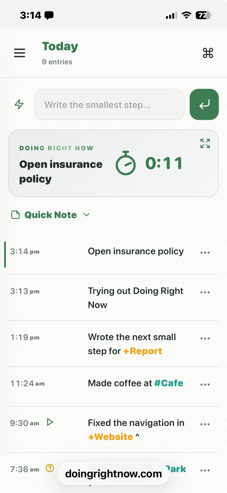

# Doing Right Now — Help

A private journal in this browser. Write one timestamped line, then do that. It is a record of starting, not a task list.

[New here? Read the philosophy →](/guide)

---

## Quick start

1. Write the smallest thing you are doing.
2. Press Enter. The line gets the current time.
3. Start a line with **8:30 AM** or **08:30** to choose a time today.
4. End a line with **!** to make the text bold.

## Navigation

The menu holds Today, Yesterday, the last 7, 30, and 60 days, All, and Search. Yesterday, the longer ranges, and All each have a search at the top that stays inside that view. Search in the menu looks through the whole journal. Copy places the lines on screen onto the clipboard, then the button reads Copied. Tap the view name in the title bar to return to Today. On Today, that tap scrolls to the top.

## Scratch Pad

The pen icon opens a note that saves as you type. Copy places only that note on the clipboard. One overall pad, not a note for each day.

## Quick Add and tags

The lightning button inserts a saved activity. Edit that list in Settings.

| Syntax | Meaning |
| --- | --- |
| `@name` | Person, shown in violet |
| `#place` | Location, shown in teal |
| `+project` | Project, shown in amber |

Keep a tag to one word. Use a hyphen for more than one word, such as `+annual-report`. Search for a tag to find its entries.

Example: `Call @Alex at #office about +website!`

## Timer and Zen mode

On Today, the newest entry shows a green timer under its time. The second hand marks passing time. Tap the timer, or the expand icon at the upper right of that entry, to open Zen mode. Tap anywhere in Zen mode to return. The **+** button closes Zen mode and puts the cursor on the next line.

## Started

The thumb beside a line means you began. A faint thumb is still open. A green thumb means you started. Use **···** to edit any line. You can change the words and the time of day. The date stays the day it was written. Delete asks before the line is removed.

## Appearance

Settings is Preferences & lists. Choose System, Light, or Dark, a font size, Loose or Tight spacing, and a time and date format. Accent colors are Green, Blue, Violet, Amber, Coral, Pumpkin, and a custom hue. The app icon and the timer stay green.

## Your data

Entries stay in this browser. Tabs opened from the same address share the journal. A different browser, profile, or device has its own journal.

Download JSON to keep a backup, or Markdown for a readable copy. Markdown cannot be imported. Import adds entries and can update ones with the same ID. It does not replace the rest of the journal.

A JSON backup from the earlier Doing Right Now journal is accepted. The lines keep the words you wrote, including a `^`. Projects, issues, and day ratings in that file are left out. The first time this journal opens in a browser that already has the earlier journal, and this one is still empty, those lines, the Scratch Pad, and Quick Add are brought over with their original times.

Clearing this site’s data in the browser removes the journal. Export JSON first if you may need it.

## Install as an app

Installing is optional. The journal opens in its own window. Storage stays in that browser.

**iPhone or iPad (Safari):** open the journal in Safari, then tap **Share → Add to Home Screen**.

**Mac (Safari):** open the journal in Safari (macOS Sonoma or later), then choose **File → Add to Dock…**, or **Share → Add to Dock**.

On desktop Chrome, use the install icon in the address bar when it is offered.

### Two journals on one device

Work and personal journals need separate browser storage. Doing Right Now does not offer accounts or a second built-in journal.

1. Use two browsers, or two profiles in the same browser. Each keeps its own journal.
2. On iPhone or iPad, add the journal to the Home Screen more than once from Safari. Each Home Screen install typically has its own journal, also separate from the Safari tab.

Installing the same site twice in Chrome on Android or desktop does not create a second journal. Those installs share one database.

On iOS, the Safari tab and a Home Screen icon are already different journals. Export before assuming they share entries.

## Privacy

This is not a password manager. Keep passwords and financial details out of the journal and the Scratch Pad.

Data is plain text in this browser. Anyone with the unlocked device can read it. Browser extensions with site access may be able to read it. Import a JSON file only if you exported it or trust it. Journal lines are shown as text.

The journal leaves the browser when you export, copy, or share it yourself.

---

*Doing Right Now was inspired by Novie by the Sea's talk on interstitial journaling — timestamped lines between tasks, one moment at a time.*
